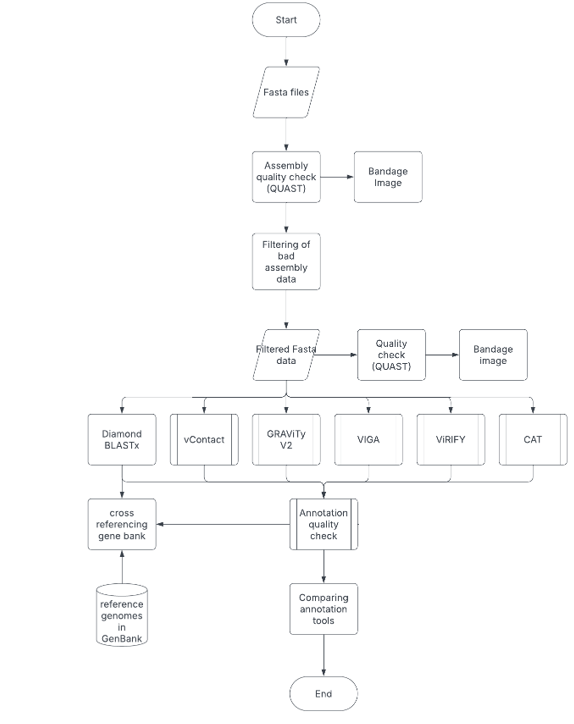

# Project-annotation
The commands and tools used during this project.
# goal of the project
The goal of this research was to investigate if there was a better tool available for annotation of viruses than diamond blastx. 
# flowchart 

# Diamondblastx
This tool was used for this research as old method. 
# Installation 
To install this tool:
<pre> bash wget http://github.com/bbuchfink/diamond/releases/download/v2.1.11/diamond-linux64.tar.gz <pre>
</pre>  tar xzf diamond-linux64.tar.gz  </pre>
With this command, the tool will be downloaded from GitHub, and with the second command, it will be unpacked. 
# NR database 
The following command download the NR database from the NCBI:
<pre> wget ftp://ftp.ncbi.nlm.nih.gov/blast/db/nt*.tar.gz</pre>
Make the database: 
<pre>diamond makedb --in nt_viruses.fasta -d nt_viruses_db</pre>
# Diamondblastx runnen
usage of the diamondblastx tool:
<pre>diamond blastx -d nr_db.dmnd -q /mnt/studentfiles/2025/2025MBI04/data_erasmus/UDI9_selected_contigs.fasta -o UDI9diamond.tsv --evalue 1e-5 --outfmt 6</pre>
-q: path to input data
-o: output file name 
-evalue: minimal e-value to form a hit, which was 1E-05
--outfmt: the format of the output, which was 6 
# output 
There was one output file per sample named for example: UDI9diamond.tsv.
The outputfile contains the following output: 
| Column Number | Name     | Description                                      |
| ------------- | -------- | ------------------------------------------------ |
| 1             | qseqid   | Query sequence ID (e.g., contig or read ID)      |
| 2             | sseqid   | Subject (hit) sequence ID (e.g., protein accession) |
| 3             | pident   | Percentage identity                              |
| 4             | length   | Alignment length                                 |
| 5             | mismatch | Number of mismatches                             |
| 6             | gapopen  | Number of gap openings                           |
| 7             | qstart   | Start position in the query                      |
| 8             | qend     | End position in the query                        |
| 9             | sstart   | Start position in the subject                    |
| 10            | send     | End position in the subject                      |
| 11            | evalue   | E-value of the alignment                         |
| 12            | bitscore | Bit score of the alignment                       |

# python script select unique viruses and accession ID
<pre># Read a file and extract the second column, storing only unique values
input_path = "/mnt/StudentFiles/2025/2025MBI04/output_diamondblastx/UDI38diamond.tsv"

# Open the file and collect unique values from the second column
unique_second_column = set()
with open(input_path, 'r') as file:
    for line in file:
        columns = line.strip().split('\t')
        if len(columns) > 1:
            unique_second_column.add(columns[1])

# Write the unique values to a new output file
output_path = "UDI38_unique_second_column.tsv"
with open(output_path, 'w') as out_file:
    for item in sorted(unique_second_column):
        out_file.write(item + '\n')

output_path
</pre>
# python script to make file with taxonomy information from accession ID
<pre>from Bio import Entrez
import csv
import time

# Enter your actual email address here
Entrez.email = "mailaddress"

def get_organism_info(accession):
    """Fetch organism information from NCBI using the protein accession number."""
    try:
        with Entrez.efetch(db="protein", id=accession, rettype="gb", retmode="xml") as handle:
            records = Entrez.read(handle)
        record = records[0]
        organism = record.get("GBSeq_organism", "Unknown")
        taxonomy = record.get("GBSeq_taxonomy", "Unknown")
        definition = record.get("GBSeq_definition", "Unknown")
        return {
            "Accession": accession,
            "Organism": organism,
            "Taxonomy": taxonomy,
            "Definition": definition,
            "Error": ""
        }
    except Exception as e:
        return {
            "Accession": accession,
            "Organism": "",
            "Taxonomy": "",
            "Definition": "",
            "Error": str(e)
        }

def read_accessions(filename):
    """Read accession numbers from a file, ignoring empty lines."""
    with open(filename, "r") as f:
        return [line.strip() for line in f if line.strip()]

def write_results_to_csv(results, output_file):
    """Write the collected organism information to a CSV file."""
    fieldnames = ["Accession", "Organism", "Taxonomy", "Definition", "Error"]
    with open(output_file, "w", newline="", encoding="utf-8") as csvfile:
        writer = csv.DictWriter(csvfile, fieldnames=fieldnames)
        writer.writeheader()
        for row in results:
            writer.writerow(row)

def main():
    input_file = "UDI38_unique_second_column.tsv"
    output_file = "UDI38_all_virusses.csv"

    accessions = read_accessions(input_file)
    results = []

    for acc in accessions:
        print(f"Searching: {acc}...")
        info = get_organism_info(acc)
        results.append(info)
        time.sleep(0.4)  # Respect NCBI rate limits

    write_results_to_csv(results, output_file)
    print(f"\n✓ Done! Results saved to: {output_file}")

if __name__ == "__main__":
    main()
</pre>
# python script to select all the unique viruses 
<pre>import pandas as pd
import os

def extract_unique_viruses(input_csv, output_csv):
    # Read the input CSV file
    df = pd.read_csv(input_csv)

    # Filter rows where 'Taxonomy' starts with 'Viruses'
    virus_df = df[df['Taxonomy'].str.startswith('Viruses', na=False)]

    # Extract unique and sorted virus names
    unique_viruses = sorted(virus_df['Organism'].unique())

    # Convert to DataFrame
    virus_list_df = pd.DataFrame(unique_viruses, columns=["VirusName"])

    # Save to CSV
    virus_list_df.to_csv(output_csv, index=False)
    print(f" {len(unique_viruses)} viruses saved to: {output_csv}")

if __name__ == "__main__":
    # Example usage
    files = [
        ("UDI9_all_virusses.csv", "unique_viruses_UDI9.csv"),
        ("UDI10_all_virusses.csv", "unique_viruses_UDI10.csv"),
        ("UDI11_all_virusses.csv", "unique_viruses_UDI11.csv"),
        ("UDI12_all_virusses.csv", "unique_viruses_UDI12.csv"),
        ("UDI13_all_virusses.csv", "unique_viruses_UDI13.csv"),
        ("UDI14_all_virusses.csv", "unique_viruses_UDI14.csv"),
        ("UDI33_all_virusses.csv", "unique_viruses_UDI33.csv"),
        ("UDI34_all_virusses.csv", "unique_viruses_UDI34.csv"),
        ("UDI35_all_virusses.csv", "unique_viruses_UDI35.csv"),
        ("UDI36_all_virusses.csv", "unique_viruses_UDI36.csv"),
        ("UDI37_all_virusses.csv", "unique_viruses_UDI37.csv"),
        ("UDI38_all_virusses.csv", "unique_viruses_UDI38.csv"),
    ]

    for input_file, output_file in files:
        if os.path.exists(input_file):
            extract_unique_viruses(input_file, output_file)
        else:
            print(f" File not found: {input_file}")
</pre>

From this output the viruses with an eukaryotic host were selected, to make the list with viruses with an eukaryotic host. 
# vcontact3 
one of the new methods 
# installation 
Instalation of vcontact3:
<pre>conda install -c bioconda vcontact3 </pre>
# database 
Download latest version of refseq database from Zenodo:
<pre>vcontact3 prepare_databases --get-version "latest"</pre>
# vcontact3 runnen
command to use vcontact3:
<pre>vcontact3 run --nucleotide /mnt/StudentFiles/2025/2025MBI04/data_erasmus/UDI36_selected_contigs.fasta --output /mnt/StudentFiles/2025/2025MBI04/output_vcontact3/UDI36  --db-version 220 --db-path /mnt/StudentFiles/2025/2025MBI04/vcontact3_db</pre>
--nucleotide: ipath to the input fasta file 
-- output: path to the output directory 
--db-version: version of the refseq database 
--db-path: path to the refseq database 
# output 
vcontact generates many temporary files, the two inportant output files are located in the directory exports. The output is named performance_metrics.csv and final_assignments.csv. 
The contens of performance_metrics.csv is shown in the table below: 
| Column Number | Name                          | Description                                    |
| ------------- | ----------------------------- | ---------------------------------------------- |
| 1             | realm                         | Taxonomic realm or domain                       |
| 2             | rank                          | Taxonomic rank (e.g., family, genus)           |
| 3             | Clustering-wise PPV           | Clustering-wise Positive Predictive Value      |
| 4             | Clustering-wise Sensitivity   | Clustering-wise Sensitivity (Recall)           |
| 5             | Clustering-wise Accuracy      | Clustering-wise Accuracy                        |
| 6             | Clustering-wise Separation    | Clustering-wise Separation                      |
| 7             | Complex-wise Separation       | Complex-wise Separation                         |
| 8             | Separation                    | Overall Separation metric                       |
| 9             | Adjusted Rand Index (ARI)     | Adjusted Rand Index for clustering comparison  |
| 10            | Normalized Mutual Info Score (NMI) | Normalized Mutual Information score           |
| 11            | Compo Score                  | Composite score combining several metrics      |

Overview of the final_assignments.csv output: 

| Column Number | Name              | Description                                    |
| ------------- | ----------------- | ---------------------------------------------- |
| 1             | index             | Index number (row identifier)                   |
| 2             | GenomeName        | Name of the genome                              |
| 3             | RefSeqID          | Reference Sequence ID                           |
| 4             | Proteins          | Number of proteins in the genome                |
| 5             | Reference         | Reference source or dataset                      |
| 6             | Size (Kb)         | Genome size in kilobases                         |
| 7             | realm (Reference) | Taxonomic realm according to the reference      |
| 8             | realm (prediction)| Predicted taxonomic realm                        |
| 9             | phylum (Reference)| Phylum according to the reference                |
| 10            | phylum (prediction)| Predicted phylum                                |
| 11            | class (Reference) | Class according to the reference                  |
| 12            | class (prediction)| Predicted class                                  |
| 13            | order (Reference) | Order according to the reference                  |
| 14            | order (prediction)| Predicted order                                  |
| 15            | family (Reference)| Family according to the reference                  |
| 16            | family (prediction)| Predicted family                                |
| 17            | subfamily (Reference)| Subfamily according to the reference            |
| 18            | subfamily (prediction)| Predicted subfamily                            |
| 19            | genus (Reference) | Genus according to the reference                   |
| 20            | genus (prediction)| Predicted genus                                  |

| 21            | network           | Network or clustering group assignment           |

