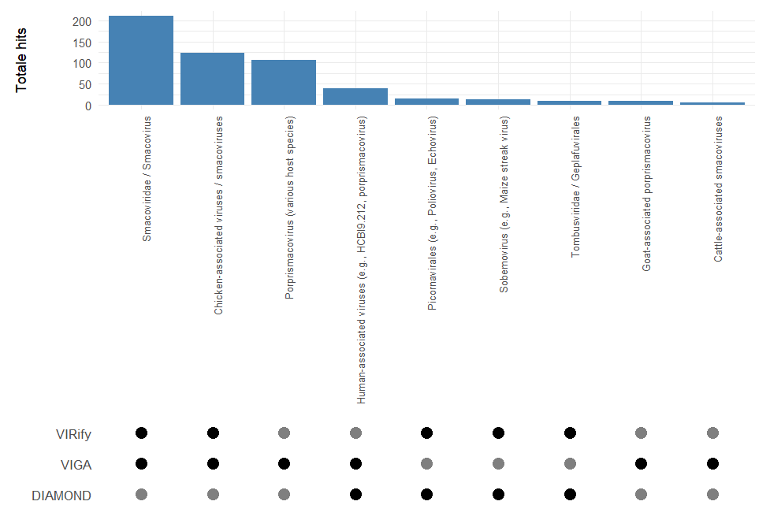
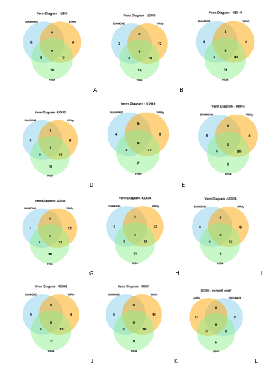

# Project-annotation
The commands and tools used during this project.
# goal of the project
The goal of this research was to investigate if there was a better tool available for annotation of viruses than diamond blastx. 
# flowchart 

# QUAST assembly quality control
To evaluate the quality of the assembled contigs and rule out data-related issues that could interfere with downstream analysis, the 12 FASTA files provided by Erasmus MC were assessed using QUAST. 
# Installation
Conda installation command:
<pre>conda install -c bioconda quast</pre>
# Input
Fasta files from Erasmus MC
# Running
Command:
<pre>quast -o quast_output -t 4 -m 500 UDI*.selected_contigs.fasta</pre>
# Output
a report was given by QUAST 

# Diamondblastx
To facilitate the identification of viral sequences within metagenomic datasets, DIAMOND blastx offers a high-speed solution for aligning translated nucleotide sequences to protein reference databases such as NCBI-nr
# Installation 
To install this tool:
<pre> bash wget http://github.com/bbuchfink/diamond/releases/download/v2.1.11/diamond-linux64.tar.gz <pre>
</pre>  tar xzf diamond-linux64.tar.gz  </pre>
With this command, the tool will be downloaded from GitHub, and with the second command, it will be unpacked. 
# NR database 
The following command download the NR database from the NCBI:
<pre> wget ftp://ftp.ncbi.nlm.nih.gov/blast/db/nt*.tar.gz</pre>
Make the database: 
<pre>diamond makedb --in nt_viruses.fasta -d nt_viruses_db</pre>
# input
Fasta files from Erasmus MC
# Running
usage of the diamondblastx tool:
<pre>diamond blastx -d nr_db.dmnd -q /mnt/studentfiles/2025/2025MBI04/data_erasmus/UDI9_selected_contigs.fasta -o UDI9diamond.tsv --evalue 1e-5 --outfmt 6</pre>
-q: path to input data
-o: output file name 
-evalue: minimal e-value to form a hit, which was 1E-05
--outfmt: the format of the output, which was 6 
# output 
There was one output file per sample named for example: UDI9diamond.tsv.
The outputfile contains the following output: 
| Column Number | Name     | Description                                      |
| ------------- | -------- | ------------------------------------------------ |
| 1             | qseqid   | Query sequence ID (e.g., contig or read ID)      |
| 2             | sseqid   | Subject (hit) sequence ID (e.g., protein accession) |
| 3             | pident   | Percentage identity                              |
| 4             | length   | Alignment length                                 |
| 5             | mismatch | Number of mismatches                             |
| 6             | gapopen  | Number of gap openings                           |
| 7             | qstart   | Start position in the query                      |
| 8             | qend     | End position in the query                        |
| 9             | sstart   | Start position in the subject                    |
| 10            | send     | End position in the subject                      |
| 11            | evalue   | E-value of the alignment                         |
| 12            | bitscore | Bit score of the alignment                       |

# python script select unique viruses and accession ID
<pre># Read a file and extract the second column, storing only unique values
input_path = "/mnt/StudentFiles/2025/2025MBI04/output_diamondblastx/UDI38diamond.tsv"

# Open the file and collect unique values from the second column
unique_second_column = set()
with open(input_path, 'r') as file:
    for line in file:
        columns = line.strip().split('\t')
        if len(columns) > 1:
            unique_second_column.add(columns[1])

# Write the unique values to a new output file
output_path = "UDI38_unique_second_column.tsv"
with open(output_path, 'w') as out_file:
    for item in sorted(unique_second_column):
        out_file.write(item + '\n')

output_path
</pre>
# python script to make file with taxonomy information from accession ID
<pre>from Bio import Entrez
import csv
import time

# Enter your actual email address here
Entrez.email = "mailaddress"

def get_organism_info(accession):
    """Fetch organism information from NCBI using the protein accession number."""
    try:
        with Entrez.efetch(db="protein", id=accession, rettype="gb", retmode="xml") as handle:
            records = Entrez.read(handle)
        record = records[0]
        organism = record.get("GBSeq_organism", "Unknown")
        taxonomy = record.get("GBSeq_taxonomy", "Unknown")
        definition = record.get("GBSeq_definition", "Unknown")
        return {
            "Accession": accession,
            "Organism": organism,
            "Taxonomy": taxonomy,
            "Definition": definition,
            "Error": ""
        }
    except Exception as e:
        return {
            "Accession": accession,
            "Organism": "",
            "Taxonomy": "",
            "Definition": "",
            "Error": str(e)
        }

def read_accessions(filename):
    """Read accession numbers from a file, ignoring empty lines."""
    with open(filename, "r") as f:
        return [line.strip() for line in f if line.strip()]

def write_results_to_csv(results, output_file):
    """Write the collected organism information to a CSV file."""
    fieldnames = ["Accession", "Organism", "Taxonomy", "Definition", "Error"]
    with open(output_file, "w", newline="", encoding="utf-8") as csvfile:
        writer = csv.DictWriter(csvfile, fieldnames=fieldnames)
        writer.writeheader()
        for row in results:
            writer.writerow(row)

def main():
    input_file = "UDI38_unique_second_column.tsv"
    output_file = "UDI38_all_virusses.csv"

    accessions = read_accessions(input_file)
    results = []

    for acc in accessions:
        print(f"Searching: {acc}...")
        info = get_organism_info(acc)
        results.append(info)
        time.sleep(0.4)  # Respect NCBI rate limits

    write_results_to_csv(results, output_file)
    print(f"\n✓ Done! Results saved to: {output_file}")

if __name__ == "__main__":
    main()
</pre>
# python script to select all the unique viruses 
<pre>import pandas as pd
import os

def extract_unique_viruses(input_csv, output_csv):
    # Read the input CSV file
    df = pd.read_csv(input_csv)

    # Filter rows where 'Taxonomy' starts with 'Viruses'
    virus_df = df[df['Taxonomy'].str.startswith('Viruses', na=False)]

    # Extract unique and sorted virus names
    unique_viruses = sorted(virus_df['Organism'].unique())

    # Convert to DataFrame
    virus_list_df = pd.DataFrame(unique_viruses, columns=["VirusName"])

    # Save to CSV
    virus_list_df.to_csv(output_csv, index=False)
    print(f" {len(unique_viruses)} viruses saved to: {output_csv}")

if __name__ == "__main__":
    # Example usage
    files = [
        ("UDI9_all_virusses.csv", "unique_viruses_UDI9.csv"),
        ("UDI10_all_virusses.csv", "unique_viruses_UDI10.csv"),
        ("UDI11_all_virusses.csv", "unique_viruses_UDI11.csv"),
        ("UDI12_all_virusses.csv", "unique_viruses_UDI12.csv"),
        ("UDI13_all_virusses.csv", "unique_viruses_UDI13.csv"),
        ("UDI14_all_virusses.csv", "unique_viruses_UDI14.csv"),
        ("UDI33_all_virusses.csv", "unique_viruses_UDI33.csv"),
        ("UDI34_all_virusses.csv", "unique_viruses_UDI34.csv"),
        ("UDI35_all_virusses.csv", "unique_viruses_UDI35.csv"),
        ("UDI36_all_virusses.csv", "unique_viruses_UDI36.csv"),
        ("UDI37_all_virusses.csv", "unique_viruses_UDI37.csv"),
        ("UDI38_all_virusses.csv", "unique_viruses_UDI38.csv"),
    ]

    for input_file, output_file in files:
        if os.path.exists(input_file):
            extract_unique_viruses(input_file, output_file)
        else:
            print(f" File not found: {input_file}")
</pre>

From this output the viruses with an eukaryotic host were selected, to make the list with viruses with an eukaryotic host. 
# vcontact3 
vConTACT3 clusters viral contigs based on shared protein content to infer taxonomy and diversity, producing distinct statistical outputs due to its network-based clustering approach. 
# installation 
Instalation of vcontact3:
<pre>conda install -c bioconda vcontact3 </pre>
# database 
Download latest version of refseq database from Zenodo:
<pre>vcontact3 prepare_databases --get-version "latest"</pre>
# input 
Fasta files from Erasmus MC
# vcontact3 runnen
command to use vcontact3:
<pre>vcontact3 run --nucleotide /mnt/StudentFiles/2025/2025MBI04/data_erasmus/UDI36_selected_contigs.fasta --output /mnt/StudentFiles/2025/2025MBI04/output_vcontact3/UDI36  --db-version 220 --db-path /mnt/StudentFiles/2025/2025MBI04/vcontact3_db</pre>
--nucleotide: ipath to the input fasta file 
-- output: path to the output directory 
--db-version: version of the refseq database 
--db-path: path to the refseq database 
# output 
vcontact generates many temporary files, the two inportant output files are located in the directory exports. The output is named performance_metrics.csv and final_assignments.csv. 
The contens of performance_metrics.csv is shown in the table below: 
| Column Number | Name                          | Description                                    |
| ------------- | ----------------------------- | ---------------------------------------------- |
| 1             | realm                         | Taxonomic realm or domain                       |
| 2             | rank                          | Taxonomic rank (e.g., family, genus)           |
| 3             | Clustering-wise PPV           | Clustering-wise Positive Predictive Value      |
| 4             | Clustering-wise Sensitivity   | Clustering-wise Sensitivity (Recall)           |
| 5             | Clustering-wise Accuracy      | Clustering-wise Accuracy                        |
| 6             | Clustering-wise Separation    | Clustering-wise Separation                      |
| 7             | Complex-wise Separation       | Complex-wise Separation                         |
| 8             | Separation                    | Overall Separation metric                       |
| 9             | Adjusted Rand Index (ARI)     | Adjusted Rand Index for clustering comparison  |
| 10            | Normalized Mutual Info Score (NMI) | Normalized Mutual Information score           |
| 11            | Compo Score                  | Composite score combining several metrics      |

Overview of the final_assignments.csv output: 

| Column Number | Name              | Description                                    |
| ------------- | ----------------- | ---------------------------------------------- |
| 1             | index             | Index number (row identifier)                   |
| 2             | GenomeName        | Name of the genome                              |
| 3             | RefSeqID          | Reference Sequence ID                           |
| 4             | Proteins          | Number of proteins in the genome                |
| 5             | Reference         | Reference source or dataset                      |
| 6             | Size (Kb)         | Genome size in kilobases                         |
| 7             | realm (Reference) | Taxonomic realm according to the reference      |
| 8             | realm (prediction)| Predicted taxonomic realm                        |
| 9             | phylum (Reference)| Phylum according to the reference                |
| 10            | phylum (prediction)| Predicted phylum                                |
| 11            | class (Reference) | Class according to the reference                  |
| 12            | class (prediction)| Predicted class                                  |
| 13            | order (Reference) | Order according to the reference                  |
| 14            | order (prediction)| Predicted order                                  |
| 15            | family (Reference)| Family according to the reference                  |
| 16            | family (prediction)| Predicted family                                |
| 17            | subfamily (Reference)| Subfamily according to the reference            |
| 18            | subfamily (prediction)| Predicted subfamily                            |
| 19            | genus (Reference) | Genus according to the reference                   |
| 20            | genus (prediction)| Predicted genus                                  |
| 21            | network           | Network or clustering group assignment           |

# python script to select top 20 viruses vcontact3 
<pre>import pandas as pd
import re
import matplotlib.pyplot as plt

# Load the CSV file
csv_path = "/mnt/StudentFiles/2025/2025MBI04/output_vcontact3/UDI38/exports/final_assignments.csv"  # <-- adjust if needed
df = pd.read_csv(csv_path)

# Column with the original GenomeName
genome_col = "GenomeName"

# Remove digits at the end (e.g., "_1", "_34")
def remove_digits(name):
    return re.sub(r"_\d+$", "", str(name))

# Add a cleaned column
df["GenomeName_cleaned"] = df[genome_col].apply(remove_digits)

# Top 20 most frequent names
top20_counts = df["GenomeName_cleaned"].value_counts().head(20)

# Save as CSV file
output_csv = "/mnt/StudentFiles/2025/2025MBI04/output_vcontact3/UDI38/processed_data/UDI38_top20_genomename_cleaned.csv"
top20_counts.to_csv(output_csv, header=["count"])
print(f"Top 20 saved as: {output_csv}")

# Create bar chart
plt.figure(figsize=(10, 6))
top20_counts.plot(kind="bar", color="skyblue")
plt.title("Top 20 Most Frequent GenomeNames (cleaned)")
plt.xlabel("GenomeName (without suffix)")
plt.ylabel("Count")
plt.xticks(rotation=45, ha='right')
plt.tight_layout()

# Save the plot
output_plot = "/mnt/StudentFiles/2025/2025MBI04/output_vcontact3/UDI38/processed_data/UDI38_top20_genomename_cleaned.png"
plt.savefig(output_plot)
print(f"Plot saved as: {output_plot}")
</pre>
# python script to select top 20 virusfamilies 
<pre>import pandas as pd

# Load the file (adjust the path if needed)
df = pd.read_csv("/mnt/StudentFiles/2025/2025MBI04/output_vcontact3/UDI38/exports/final_assignments.csv")

# Count the number of viruses per predicted family (including missing values)
family_counts = df['family (prediction)'].value_counts(dropna=False).reset_index()
family_counts.columns = ['Predicted Family', 'Count']

# Sort and display the top 20
top_20_families = family_counts.sort_values(by='Count', ascending=False).head(20)

# Optional: print the table
print(top_20_families)

# Optional: save as CSV file
top_20_families.to_csv("UDI38_top_20_families.csv", index=False)
</pre>
# python script to create an overview of all samples
<pre>import pandas as pd

# Path to your Excel file
file_path = "vcontact3 output most common viruses.xlsx"

# Read the Excel file and load all sheets
xls = pd.ExcelFile(file_path)
all_samples = {sheet: xls.parse(sheet) for sheet in xls.sheet_names}

# Process each sheet and ensure consistent column names
for sample, df in all_samples.items():
    df.columns = ["GenomName_cleaned", "count"]
    all_samples[sample] = df

# Combine all samples into a summary table
combined_df = pd.concat([
    df.set_index("GenomName_cleaned").rename(columns={"count": sample})
    for sample, df in all_samples.items()
], axis=1)

# Replace missing values with 0 and convert to integers
combined_df = combined_df.fillna(0).astype(int)

# Save as Excel file
combined_df.to_excel("overview_viruses_per_sample.xlsx")

print("Overview saved as: overview_viruses_per_sample.xlsx")
</pre>

# VIRify
The second method investigated was the EMG-pipeline VIRify, a workflow specifically designed to detect, annotate, and taxonomically classify viral contigs within metagenomic assemblies. VIRify integrates multiple tools to assess annotation quality, taxonomic identity, and genome completeness of viral sequences.
# installation
Nextflow installation:
<pre>curl -s https://get.nextflow.io | bash</pre>
Nextflow pull:
<pre>nextflow pull EBI-Metagenomics/emg-viral-pipeline</pre>
# Input
Data given by Erasmus MC
# Running the tool
Command:
<pre>nextflow run main.nf --assembly ~/data_erasmus/UDI*.selected_contigs.fasta --outdir output_VIRify</pre>
# Output
The output consist of multiple datasets seperated in low confidence, high confidence and prophages.
    
# viga 
VIGA was the third method evaluated, providing detailed viral genome annotations by identifying coding regions, functional domains, and key proteins through similarity searches and hidden Markov models.  
# installation 
command to clone viga from github: 
<pre>git clone https://github.com/EGTortuero/viga.git</pre>
command to use the bash script that install all the needed tools:
<pre>Bash install.sh</pre>
# database 
bash command to create a database for viga: 
<pre>Create_dbs.sh</pre>

# python script to create a modifier file 

script to make the needed modifer file to run this tool: 
<pre>modifiers = "[organism=] [subspecies=] [strain=] [moltype=DNA] [tech=] [gcode=11] [country=Netherlands] [isolation-source= goat feces] "
 
input_file = "/mnt/StudentFiles/2025/2025MBI04/data_erasmus/UDI38_selected_contigs.fasta"
output_file = "/mnt/StudentFiles/2025/2025MBI04/viga_modifier/UDI38_modified.fasta"
 
with open(input_file, "r") as infile, open(output_file, "w") as outfile:
    for line in infile:
        if line.startswith(">"):
            line = line.strip() + " " + modifiers + "\n"
     outfile.write(line)
</pre>

  # input
  own made modifier file and fasta files from Erasmsus MC
# running
command to use the tool viga: 
<pre>python3 VIGA.py --input /mnt/StudentFiles/2025/2025MBI04/data_erasmus/UDI38_selected_contigs.fasta --modifiers /mnt/StudentFiles/2025/2025MBI04/viga_modifier/UDI38_modified.fasta --out /mnt/StudentFiles/2025/2025MBI04/viga_output/UDI38/</pre>
--input: path to input file 
--modifier: path to own made modifier file 
--out: path to output directory 
# output
viga generates one important output file for example named:  UDI9.csv
The output of this file looks like this: 
| Column Number | Column Name         | Description                                                                 |
|---------------|---------------------|-----------------------------------------------------------------------------|
| 1             | Contig              | Name or ID of the contig the protein was predicted from                    |
| 2             | Protein ID          | Unique identifier of the predicted protein                                 |
| 3             | Start               | Start position of the ORF on the contig                                    |
| 4             | Stop                | Stop position of the ORF on the contig                                     |
| 5             | Strand              | DNA strand the ORF is located on (+ or -)                                  |
| 6             | size_aa             | Length of the predicted protein in amino acids                             |
| 7             | pI                  | Isoelectric point (predicted pH at which the protein has no net charge)    |
| 8             | Mol_weight_kDa      | Molecular weight of the protein in kilodaltons                             |
| 9             | Instability_index   | Protein stability index; values >40 suggest instability                     |
| 10            | Description         | Functional annotation or predicted description of the protein              |
| 11            | Source              | Origin of the annotation (e.g., database/tool used)                        |
| 12            | Perc_ID             | Percentage identity with best hit (e.g., from BLAST)                       |
| 13            | Perc_Cov            | Percentage coverage of the query compared to the hit                       |
| 14            | E-value             | E-value of the match from the annotation tool                              |
| 15            | HMMer               | HMM profile name or ID (if identified by HMMer)                            |
| 16            | HMMer_Perc_Cov      | Coverage of the HMM model matched                                          |
| 17            | HMMer_E-value       | E-value from HMMer matching                                                 |

# pyton script to select all unique viruses 
Script to select all viruses from the output: 
<pre>import pandas as pd  # Import the pandas library for data handling

# === Settings ===
input_file = "/mnt/StudentFiles/2025/2025MBI04/viga_output/UDI38/UDI38.csv"  
# Define the input CSV file path (change this if analyzing another sample)

output_file = "/mnt/StudentFiles/2025/2025MBI04/viga_output/UDI38/UDI38_all_viruses_viga_-,.csv"
# Define the output file path where the summary will be saved

# === Load the data ===
df = pd.read_csv(input_file, sep=None, engine="python")  
# Load the CSV file into a pandas DataFrame
# sep=None allows automatic detection of delimiter (e.g., comma or tab)
# engine="python" is required for autodetection of delimiters

# === Check if required columns are present ===
required_cols = ["Description", "size_aa", "Perc_ID", "Perc_Cov", "E-value"]
# Define which columns must be present for the analysis

missing_cols = [col for col in required_cols if col not in df.columns]
# Create a list of missing columns by checking each required column

if missing_cols:
    raise ValueError(f"The following columns are missing from the input: {missing_cols}")
    # Stop execution and report which columns are missing if any are not found

# === Keep only the necessary columns ===
df_relevant = df[required_cols].copy()
# Make a copy of the DataFrame with only the required columns

# === Remove rows with missing values ===
df_relevant = df_relevant.dropna(subset=["Perc_ID", "Perc_Cov", "E-value"])
# Remove rows that are missing any of the key numeric values

# === Clean up virus names (remove commas) ===
df_relevant["Virus"] = df_relevant["Description"].str.replace(",", "", regex=False)
# Create a new column 'Virus' based on 'Description' but without commas
# This prevents issues when exporting as CSV

# === Count the number of hits per virus ===
df_relevant["Hits"] = 1
# Add a column where every row counts as one "hit"

virus_counts = df_relevant.groupby("Virus")["Hits"].count().reset_index(name="Total_hits")
# Group by virus name and count how many times each virus appears
# Store result in a new DataFrame with columns: Virus and Total_hits

# === Generate per-virus summary statistics ===
summary = df_relevant.groupby("Virus").agg({
    "size_aa": "mean",      # Average protein length
    "Perc_ID": "mean",      # Average percent identity
    "Perc_Cov": "mean",     # Average percent coverage
    "E-value": "min"        # Best (smallest) E-value
}).reset_index()
# This creates a summary table with aggregated values per virus

# === Merge summary with hit counts ===
summary = summary.merge(virus_counts, on="Virus")
# Add the total hit counts to the summary table by merging on the Virus column

# === Save the summary to a new CSV file ===
summary.to_csv(output_file, index=False)
# Write the summary table to a CSV file
# index=False prevents writing the DataFrame index as an extra column

# === Confirmation message ===
print(f"All viruses summarized and saved in: {output_file}")
# Notify the user that the process is complete and show the file path
   </pre>
   
# script to select viruses with statistical data
<pre>import pandas as pd  # Import the pandas library for data processing

# === Read the input file ===
df = pd.read_csv('/mnt/StudentFiles/2025/2025MBI04/viga_output/UDI12/UDI12.csv', sep=';')
# Load the CSV file from the specified path
# The separator is a semicolon (;) instead of a comma

# === Clean up column names ===
df.columns = df.columns.str.strip()
# Remove any leading or trailing spaces from column names to avoid errors later

# === Print column names and their index positions (for debugging or inspection) ===
for i, col in enumerate(df.columns):
    print(f"{i}: {col}")
# This loop prints each column name along with its index number
# Helpful to find out which column holds the data you want (like E-value)

# === Select the column by index ===
evalue_col = df.columns[13]
# Choose the 14th column (index 13, because Python uses zero-based indexing)
# This is assumed to be the E-value column

# === Filter rows where that column is not empty (i.e., not NA) ===
filtered_df = df[df[evalue_col].notna()]
# Keep only the rows where the E-value column has a value (not missing)

# === Save the filtered data to a new file ===
filtered_df.to_csv(
    '/mnt/StudentFiles/2025/2025MBI04/viga_output/output_all/UDI12_e-value.csv',
    sep='\t',  # Use tab as separator
    index=False  # Do not include the index column in the output
)

# === Print confirmation ===
print(f"Filtering complete based on column '{evalue_col}'. Output saved to 'filtered_output.tsv'.")
# Notify the user that filtering was successful and show which column was used
</pre>

# script to count viruses

<pre>import os  # Module for interacting with the file system
import csv  # Module for reading and writing CSV files
from collections import defaultdict  # To create default dictionaries with initial values

def main():
    # === List of input CSV files, one per sample ===
    sample_files = [
        "/mnt/StudentFiles/2025/2025MBI04/viga_output/UDI9/UDI9.csv",
        "/mnt/StudentFiles/2025/2025MBI04/viga_output/UDI10/UDI10.csv",
        "/mnt/StudentFiles/2025/2025MBI04/viga_output/UDI11/UDI11.csv",
        "/mnt/StudentFiles/2025/2025MBI04/viga_output/UDI12/UDI12.csv",
        "/mnt/StudentFiles/2025/2025MBI04/viga_output/UDI13/UDI13.csv",
        "/mnt/StudentFiles/2025/2025MBI04/viga_output/UDI14/UDI14.csv",
        "/mnt/StudentFiles/2025/2025MBI04/viga_output/UDI33/UDI33.csv",
        "/mnt/StudentFiles/2025/2025MBI04/viga_output/UDI34/UDI34.csv",
        "/mnt/StudentFiles/2025/2025MBI04/viga_output/UDI35/UDI35.csv",
        "/mnt/StudentFiles/2025/2025MBI04/viga_output/UDI36/UDI36.csv",
        "/mnt/StudentFiles/2025/2025MBI04/viga_output/UDI37/UDI37.csv",
        "/mnt/StudentFiles/2025/2025MBI04/viga_output/UDI38/UDI38.csv"
    ]

    # === Dictionary to store virus counts across all samples ===
    # Each virus maps to a list of counts: [count_sample1, count_sample2, ..., count_sample12, total_count]
    virus_counts = defaultdict(lambda: [0] * (len(sample_files) + 1))  # +1 is for total count

    # === Loop over each file (one per sample) ===
    for idx, filepath in enumerate(sample_files):
        with open(filepath, newline='') as csvfile:
            reader = csv.DictReader(csvfile, delimiter=';')  # Use semicolon as delimiter
            if 'Description' not in reader.fieldnames:
                # If the expected column is missing, report and skip this file
                print(f"ERROR: 'Description' column not found in {filepath}")
                continue

            # === Process each row ===
            for row in reader:
                virus = row['Description'].strip()  # Remove any extra spaces
                if virus:
                    virus_counts[virus][idx] += 1  # Count this virus in the current sample
                    virus_counts[virus][-1] += 1   # Also add to the total count

    # === Create output folder if it doesn't exist ===
    output_dir = "/mnt/StudentFiles/2025/2025MBI04/viga_output/output_all"
    os.makedirs(output_dir, exist_ok=True)  # Don't throw error if directory already exists

    # === Define and open the output file ===
    output_file = os.path.join(output_dir, "virus_counts_by_description.csv")
    with open(output_file, 'w', newline='') as outcsv:
        writer = csv.writer(outcsv)

        # === Write header row ===
        sample_names = [f"Sample_{i+1}" for i in range(len(sample_files))]  # Sample_1, Sample_2, ...
        header = ["Virus"] + sample_names + ["Total"]
        writer.writerow(header)

        # === Write counts per virus ===
        for virus in sorted(virus_counts):
            row = [virus] + virus_counts[virus]
            writer.writerow(row)

    # === Print confirmation ===
    print(f"Output written to {output_file}")

# === Run the main function ===
if __name__ == "__main__":
    main()
# This check ensures the script runs only when executed directly (not when imported as a module)
</pre>
# UPset plot
A upset plot was made, showing per virus the total amount of hits identified by each tool (limited to those with eukaryotic hosts).
# R script
The R script run in R studios for the upset plot:
<pre>
#  packages
library(readxl)
library(dplyr)
library(ggplot2)
library(tidyr)
library(patchwork)

# 1. Data read in
df <- read_excel("plot_table.xlsx", skip = 1)
colnames(df) <- c("Virus", "Sample", "DIAMOND", "VIRify", "VIGA")

# 2. Clean up and prep
df <- df %>%
  filter(!is.na(Virus)) %>%
  mutate(across(c(DIAMOND, VIRify, VIGA), as.numeric)) %>%
  mutate(
    total_hits = DIAMOND + VIRify + VIGA
  ) %>%
  arrange(desc(total_hits)) %>%
  mutate(virus_id = factor(Virus, levels = unique(Virus)))  # x-as volgorde

# 3. Matrixdata: long format, that determines if there was at least 1 hit
matrix_data <- df %>%
  select(virus_id, DIAMOND, VIRify, VIGA) %>%
  pivot_longer(cols = c(DIAMOND, VIRify, VIGA), names_to = "tool", values_to = "hits") %>%
  mutate(hit = hits > 0)

# 4. Barplot: total hits per virus
bar <- ggplot(df, aes(x = virus_id, y = total_hits)) +
  geom_col(fill = "steelblue") +
  labs(y = "Totale hits", x = NULL) +
  theme_minimal() +
  theme(axis.text.x = element_text(angle = 90, hjust = 1, size = 8))

# 5. Matrixplot down
matrix <- ggplot(matrix_data, aes(x = virus_id, y = tool)) +
  geom_point(aes(color = hit), size = 4) +
  scale_color_manual(values = c("TRUE" = "black", "FALSE" = NA)) +
  labs(x = NULL, y = NULL) +
  theme_minimal() +
  theme(
    axis.text.x = element_blank(),
    axis.text.y = element_text(size = 10),
    panel.grid = element_blank(),
    legend.position = "none"
  )

# 6. Combine both plots
(bar / matrix) +
  plot_annotation(title = "Totaal aantal hits per virus met tooldetectie (bolletjes)")
</pre>
# Input
A excel sheet with the amount of hits per tool and also in total but also seperated by sample.

# Output:
An upset plot:

# Venn diagram 
The Venn diagrams made visualize the overlap in virus annotations identified by different bioinformatics tools across multiple samples. These diagrams help to illustrate both unique and shared viral identifications, providing insight into the consistency and complementarity of the tools used.
# R script Venn diagram
<pre># === Load required packages ===
library(readxl)   # To read Excel files
library(dplyr)    # For data manipulation
library(grid)     # For low-level drawing of graphics (used here for manual Venn diagrams)

# === Load the data from Excel ===
file_path <- "plot table.xlsx"  # Path to the Excel file
data <- read_excel(file_path, sheet = "Blad1", skip = 1)
# Reads sheet "Blad1" from the Excel file, skipping the first row (e.g., header notes)

# === Rename columns to standardized names ===
colnames(data) <- c("VirusGroup", "Sample", "DIAMOND", "VIRify", "VIGA")

# === Replace NA values (missing data) with zero ===
data$DIAMOND[is.na(data$DIAMOND)] <- 0
data$VIRify[is.na(data$VIRify)] <- 0
data$VIGA[is.na(data$VIGA)] <- 0

# === Summarize hits per tool per sample and virus group ===
grouped_hits <- data %>%
  group_by(Sample, VirusGroup) %>%
  summarise(
    DIAMOND_hits = sum(DIAMOND),  # Sum of DIAMOND hits in each group
    VIRify_hits = sum(VIRify),    # Sum of VIRify hits
    VIGA_hits = sum(VIGA),        # Sum of VIGA hits
    .groups = "drop"              # Do not keep grouping structure
  ) %>%
  mutate(
    DIAMOND = DIAMOND_hits > 0,   # Logical: was there a DIAMOND hit?
    VIRify = VIRify_hits > 0,     # Logical: was there a VIRify hit?
    VIGA = VIGA_hits > 0          # Logical: was there a VIGA hit?
  )

# === Create output folder for plots ===
dir.create("venn_plots", showWarnings = FALSE)
# Creates the folder only if it doesn't exist; suppress warnings if it already exists

# === Get the list of unique samples ===
samples <- unique(grouped_hits$Sample)

# === Loop over each sample and create a custom Venn diagram ===
for (s in samples) {
  df <- subset(grouped_hits, Sample == s)  # Filter data for this sample
  
  d <- df$DIAMOND  # Logical vector: TRUE if DIAMOND hit exists
  v <- df$VIRify   # Logical vector: TRUE if VIRify hit exists
  g <- df$VIGA     # Logical vector: TRUE if VIGA hit exists

  # === Count hits for each region of the Venn diagram ===
  only_d_hits <- sum(df$DIAMOND_hits[d & !v & !g])
  only_v_hits <- sum(df$VIRify_hits[!d & v & !g])
  only_g_hits <- sum(df$VIGA_hits[!d & !v & g])
  
  d_v_hits     <- sum(df$DIAMOND_hits[d & v & !g] + df$VIRify_hits[d & v & !g])
  d_g_hits     <- sum(df$DIAMOND_hits[d & !v & g] + df$VIGA_hits[d & !v & g])
  v_g_hits     <- sum(df$VIRify_hits[!d & v & g] + df$VIGA_hits[!d & v & g])
  d_v_g_hits   <- sum(df$DIAMOND_hits[d & v & g] + df$VIRify_hits[d & v & g] + df$VIGA_hits[d & v & g])

  # === Start a new PNG file for plotting ===
  png(paste0("venn_plots/venn_", make.names(s), ".png"), width = 2000, height = 2000, res = 300)
  grid.newpage()  # Start fresh page for the plot

  # === Draw the three overlapping circles ===
  grid.circle(x = 0.4, y = 0.6, r = 0.25, gp = gpar(col = NA, fill = "skyblue", alpha = 0.5))    # DIAMOND
  grid.circle(x = 0.6, y = 0.6, r = 0.25, gp = gpar(col = NA, fill = "orange", alpha = 0.5))     # VIRify
  grid.circle(x = 0.5, y = 0.4, r = 0.25, gp = gpar(col = NA, fill = "lightgreen", alpha = 0.5)) # VIGA

  # === Add titles for each tool ===
  grid.text("DIAMOND", x = 0.25, y = 0.85, gp = gpar(fontsize = 12, fontface = "bold"))
  grid.text("VIRify", x = 0.75, y = 0.85, gp = gpar(fontsize = 12, fontface = "bold"))
  grid.text("VIGA", x = 0.5, y = 0.13, gp = gpar(fontsize = 12, fontface = "bold"))

  # === Add main title with sample name ===
  grid.text(paste("Venn Diagram -", s), y = 0.95, gp = gpar(fontsize = 16, fontface = "bold"))

  # === Add counts in the respective circle areas ===
  grid.text(only_d_hits, x = 0.25, y = 0.6, gp = gpar(fontsize = 20, fontface = "bold"))
  grid.text(only_v_hits, x = 0.75, y = 0.6, gp = gpar(fontsize = 20, fontface = "bold"))
  grid.text(only_g_hits, x = 0.5, y = 0.22, gp = gpar(fontsize = 20, fontface = "bold"))

  grid.text(d_v_hits, x = 0.5, y = 0.7, gp = gpar(fontsize = 20, fontface = "bold"))
  grid.text(d_g_hits, x = 0.37, y = 0.42, gp = gpar(fontsize = 20, fontface = "bold"))
  grid.text(v_g_hits, x = 0.63, y = 0.42, gp = gpar(fontsize = 20, fontface = "bold"))

  grid.text(d_v_g_hits, x = 0.5, y = 0.5, gp = gpar(fontsize = 20, fontface = "bold"))

  dev.off()  # Close and save the PNG file
}
</pre>
# input 
A excel sheet with the amount of hits per tool and also in total but also seperated by sample.
# output
A venn diagram was made for every sample (UDI9 to UDI14 and UDI33 to UDI38):

